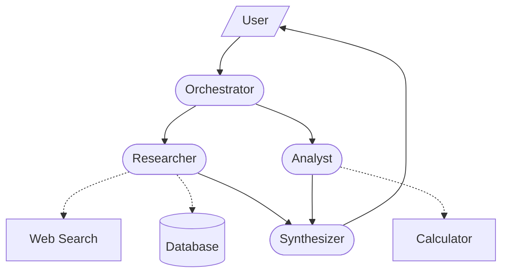

# Architecture Document Template

Use this structure when writing the output document. The document targets PoC / hackathon / MVP scope — enough detail to build with an agent SDK, not a production design doc.

## Contents

1. [Executive Summary](#1-executive-summary)
2. [Use Case Analysis](#2-use-case-analysis)
3. [Pattern Selection Rationale](#3-pattern-selection-rationale)
4. [System Architecture](#4-system-architecture) — includes Mermaid diagram conventions
5. [Agent Specifications](#5-agent-specifications)
6. [Implementation Notes](#6-implementation-notes)
7. [Future Considerations](#7-future-considerations)
8. [References](#8-references)

## Document Structure

# Agent Architecture: {Use Case Title}

> Generated by multi-agent-architecture skill | {Date}

## 1. Executive Summary

2-3 sentences: what system is being designed, which primary pattern is recommended, and the key insight driving the recommendation. State that this is a PoC/MVP design.

## 2. Use Case Analysis

### Business Context

Problem statement, users, what a successful demo looks like.

### Requirements Summary

| Dimension | Assessment |
|-----------|-----------|
| Task predictability | Low / Medium / High |
| Correctness importance | Low / Medium / High |
| Scale of decomposition | Simple (1-3 steps) / Moderate (3-10) / Complex (10+) |
| Input variability | Uniform / Moderate / Highly variable |

### Inputs and Outputs

- **Input**: What the system receives
- **Output**: What the system produces

## 3. Pattern Selection Rationale

### Primary Pattern: {Pattern Name}

Why this pattern was selected. Reference specific criteria from the decision framework. Cite source literature.

### Supporting Patterns (if any)

Only patterns essential to making the demo work. Skip "nice to have" patterns.

### Rejected Alternatives

| Pattern | Why Not for This PoC |
|---------|---------------------|
| Pattern A | Reason |

### Complexity Check

Could this be done with fewer agents? State the simplest viable alternative and why the recommended approach is worth the extra complexity.

## 4. System Architecture

### Component Overview

Brief description of agents and how they interact. Focus on the data flow.

### Architecture Diagram

Use a Mermaid `graph` diagram following the **draw_graph style** — clean, structural, focused on agent relationships:

**Diagram principles:**
- Show agents, tools, and handoff/delegation relationships
- Do NOT label edges with detailed data payloads — use simple labels like "delegates", "queries", "result" or omit labels for obvious flows
- Do NOT include a legend subgraph — use consistent shapes instead
- Keep the diagram to **one screen height** — if it needs scrolling, simplify
- Prefer `LR` (left-right) layout for linear flows, `TD` (top-down) for hierarchical

**Node shapes:**
- Agents: `([Agent Name])` — stadium/rounded
- Tools: `[Tool Name]` — rectangle
- Human: `[/Human/]` — parallelogram

**Edge styles:**
- Agent-to-agent handoffs: solid arrow `-->`
- Agent-to-tool calls: dotted arrow `-.->`
- Results flowing back: omit (implied) unless the return path is non-obvious

**Example — clean style:**

**Anti-patterns to avoid:**
- Bidirectional arrows for every request/response pair (clutters the diagram)
- Labeling every edge with the full data schema
- Legend subgraphs that take up diagram space
- More than ~10 nodes (simplify or group)

## 5. Agent Specifications

For each agent, use this compact format:

### {Agent Name}

| Property | Value |
|----------|-------|
| **Role** | One sentence — what this agent does |
| **Tools** | List of tools/APIs it can call |
| **Input** | What it receives |
| **Output** | What it produces |

Keep it brief. Skip "model tier" and "autonomy level" — those are implementation details decided when coding.

## 6. Implementation Notes

Practical notes for building this with an agent SDK:

- **Suggested SDK**: Which framework fits (Claude Agent SDK, LangGraph, OpenAI Agents SDK) and why
- **Key integration points**: APIs, databases, or services to connect
- **Simplification shortcuts**: What to hardcode, mock, or skip for the PoC
- **Known gotchas**: Things that will be tricky (e.g., tool auth, rate limits)

## 7. Future Considerations

> These are NOT part of the PoC scope. Document them as notes for after the prototype proves the concept.

Production concerns to address later:

- **Error handling & resilience**: Retry strategies, circuit breakers, graceful degradation
- **Human-in-the-loop**: Approval workflows, escalation paths
- **Observability**: Logging agent decisions, tracing multi-agent flows
- **Scaling**: Concurrent users, caching, cost optimization
- **Security**: Input validation, tool authorization, data access controls
- **Evaluation**: Automated quality checks, LLM-as-judge rubrics

## 8. References

| Pattern/Concept | Source |
|----------------|--------|
| Pattern name | [Author: Title](URL) |
